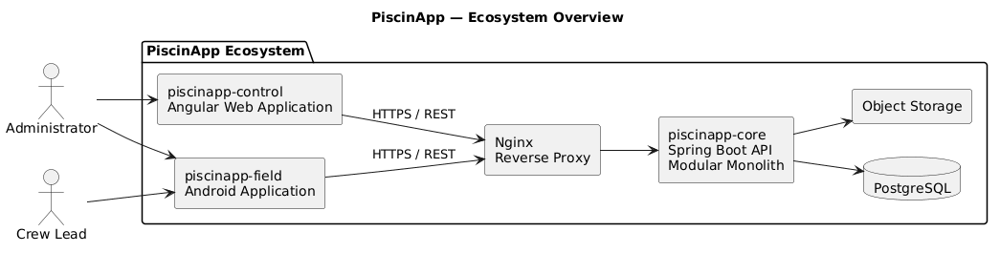
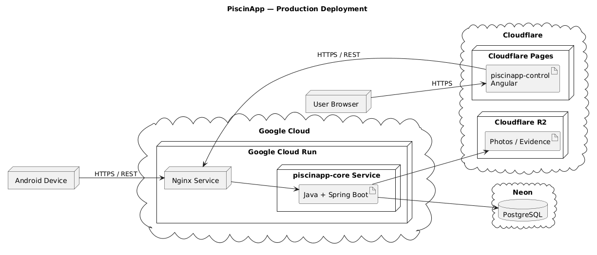

# PiscinApp

PiscinApp is an application ecosystem focused on the planning, execution, and supervision of periodic swimming pool maintenance.

The project is divided into independent components for the backend, web administration, and field work, while maintaining a shared product vision from this descriptive repository.

---

## Ecosystem

| Service | Main technology | CI | Quality Gate | Repository |
|---|---|---|---|---|
| `piscinapp-core` | Java · Spring Boot · PostgreSQL |  |  | Backend API |
| `piscinapp-control` | Angular · TypeScript · Tailwind CSS |  |  | Web application |
| `piscinapp-field` | Java · Android SDK |  |  | Android application |

> Final links and badges will be added when each repository and its corresponding automation are available.

---

## General architecture

`piscinapp-control` and `piscinapp-field` consume the public `piscinapp-core` API through Nginx, which acts as the backend entry point.

---

## Repositories

Each PiscinApp component maintains its own repository, Git history, branches, releases, and automation. This repository serves only as the general presentation of the ecosystem and does not contain copies of the other projects.

---

## Deployment

The target infrastructure considers independent deployment of the different ecosystem components, with PostgreSQL as the primary relational database and Cloudflare R2 as the selected object-storage service for photographs and evidence when that capability is introduced.

---

## Components

- **piscinapp-core** — REST API and business core developed with Java and Spring Boot.
- **piscinapp-control** — administration web application developed with Angular.
- **piscinapp-field** — native Android application for field operations.

---

## Author

**Randy Méndez**
