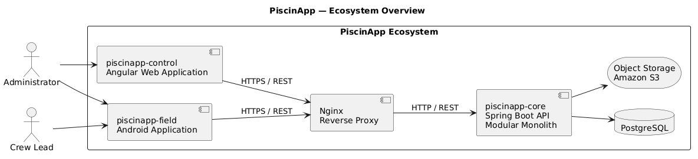
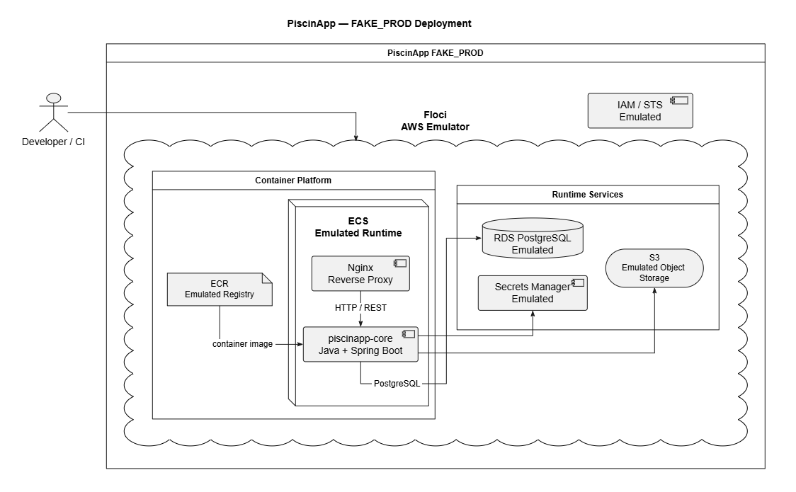
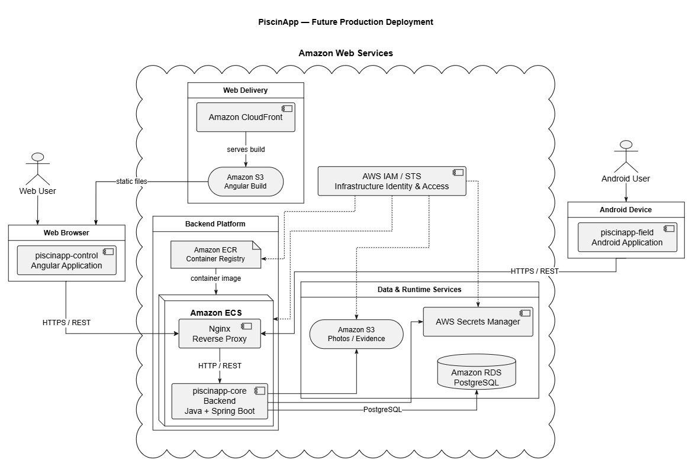
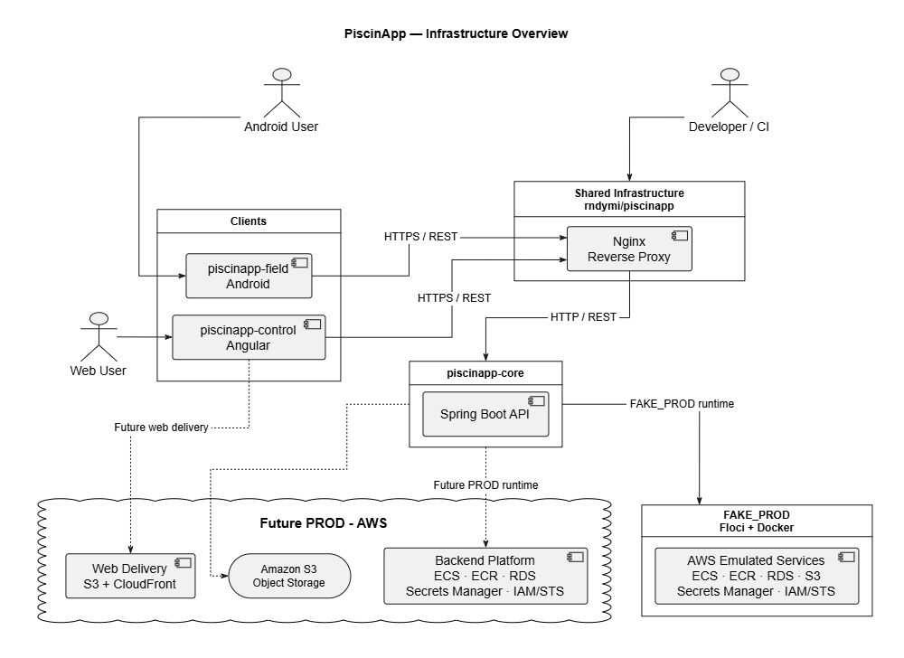

# PiscinApp

PiscinApp is an application ecosystem focused on the planning, execution, and supervision of periodic swimming pool maintenance.

The ecosystem is divided into independent components for backend services, web administration, and field operations, while sharing the same product vision and infrastructure principles.

---

## Ecosystem

| Component | Main technology | CI | Quality Gate | Purpose |
| --- | --- | --- | --- | --- |
| `piscinapp-core` | Java · Spring Boot · PostgreSQL |  |  | Backend API, business rules, security and persistent state |
| `piscinapp-control` | Angular · TypeScript · Tailwind CSS |  |  | Web administration, planning and supervision |
| `piscinapp-field` | Java · Android SDK |  |  | Android application for field operations |

Each component maintains its own repository, Git history, versioning, releases and automation.

Repository links and badges can be added as each component reaches the corresponding public automation and release milestones.



---

## General architecture

`piscinapp-control` and `piscinapp-field` consume the public API provided by `piscinapp-core`.

Nginx acts as the backend infrastructure entry point, while authentication, authorization, domain rules and persistent consistency remain responsibilities of Core.

---

## Environments

PiscinApp distinguishes four execution contexts:

```text
DEV
TEST
FAKE_PROD
PROD
```

- **DEV** — normal local development of each component.
- **TEST** — automated and isolated validation with fictitious data.
- **FAKE_PROD** — production-shaped infrastructure for deployment and integration validation without requiring a real cloud account.
- **PROD** — future real production environment.

FAKE_PROD is based on Docker and Floci.

Floci provides AWS-compatible services for local and CI validation. A successful FAKE_PROD execution validates the emulated topology, container runtime and integration contracts, but it is not considered equivalent to a real AWS deployment.



---

## Infrastructure direction

The infrastructure model is AWS-oriented.

The main responsibilities are planned around:

| Responsibility | FAKE_PROD | Future PROD |
| --- | --- | --- |
| Container registry | Floci ECR | Amazon ECR |
| Container runtime | Floci ECS | Amazon ECS |
| Relational database | Floci RDS PostgreSQL | Amazon RDS for PostgreSQL |
| Runtime secrets | Floci Secrets Manager | AWS Secrets Manager |
| Object storage | Floci S3 | Amazon S3 |
| Cloud identity | Floci IAM / STS | AWS IAM / STS |
| Web static delivery | Local/emulated validation as required | Amazon S3 + Amazon CloudFront |

Only infrastructure required by real PiscinApp capabilities will be introduced.

The future production environment keeps the same responsibility boundaries validated through FAKE_PROD while using real AWS services and production-grade configuration.



---

## Infrastructure overview

The following diagram provides a compact view of how the main PiscinApp components, shared infrastructure, FAKE_PROD environment and future AWS production direction fit together.

It is intended as a high-level overview rather than a replacement for the environment-specific deployment diagrams.



---

## Shared infrastructure

This repository coordinates ecosystem-wide infrastructure that does not belong to a single application component.

The current repository owns the shared Nginx backend edge configuration and its validation workflow.

The shared infrastructure direction is organized around:

```text
infrastructure/
├── nginx/
└── floci/
```

Floci is consumed as an external containerized tool; its source code is not copied into PiscinApp.

FAKE_PROD automation is kept deliberately lightweight and focused on reproducible Docker and Floci execution rather than introducing infrastructure tooling that is unnecessary for the scope of the project.

---

## Nginx

Nginx remains the backend entry boundary:

```text
piscinapp-control ─┐
                   ├→ Nginx → piscinapp-core
piscinapp-field ───┘
```

Its responsibilities are infrastructure-oriented, such as reverse proxying, routing, forwarded headers and explicitly configured edge controls.

Nginx does not replace Spring Security or Core business authorization.

The Nginx configuration and image source are owned by this global repository rather than by `piscinapp-core`.

---

## Engineering services

PiscinApp uses real engineering services where they can be used without requiring the runtime infrastructure to be publicly deployed:

- GitHub for source control and project coordination;
- GitHub Actions for automation;
- SonarCloud for automated quality analysis.

The development and FAKE_PROD strategy is designed to remain executable without mandatory cloud billing, deposits or paid runtime infrastructure.

---

## Repositories

The ecosystem is organized through independent repositories:

| Repository | Responsibility |
| --- | --- |
| `piscinapp-core` | REST API, business rules, security and persistent backend state |
| `piscinapp-control` | Web administration, planning and supervision |
| `piscinapp-field` | Android application for field operations |
| `piscinapp` | Global presentation and shared ecosystem infrastructure |

This repository does not contain copies of the three application projects.

---

## Production status

PiscinApp does not currently claim a public production deployment.

The project keeps a future real **PROD** direction based on AWS while using **FAKE_PROD** to validate production-shaped infrastructure, deployment flows and integrations during development.

Before a real production environment is activated, areas such as AWS account ownership, networking, IAM, TLS/DNS, observability, backup and recovery, runtime secrets, release promotion and rollback procedures must be explicitly closed and validated.

---

## Author

**Randy Méndez**